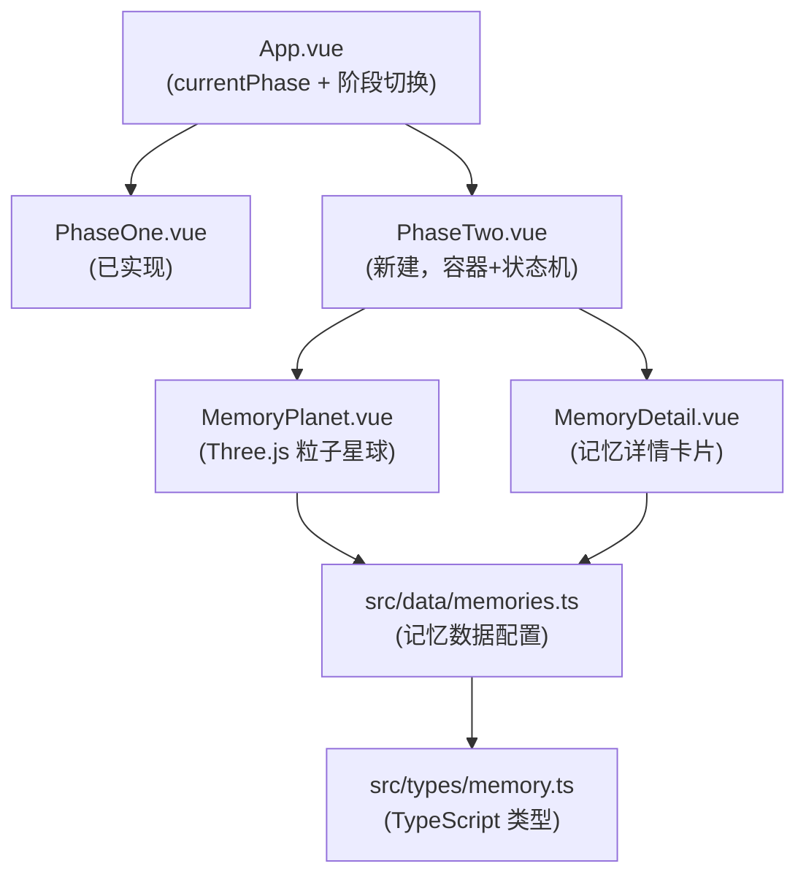
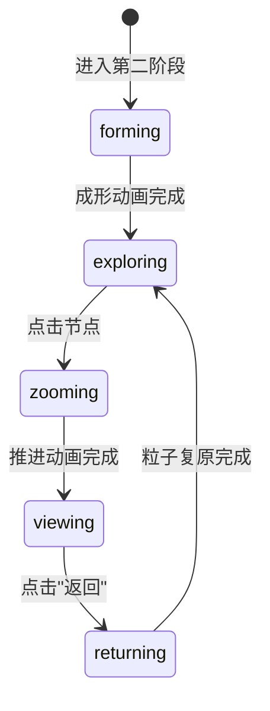

# 实现第二阶段：记忆星球

## 架构概览



## 文件清单

**新建文件：**
- [`src/types/memory.ts`](src/types/memory.ts) — 类型定义
- [`src/data/memories.ts`](src/data/memories.ts) — 静态记忆内容（Demo 数据）
- [`src/components/PhaseTwo.vue`](src/components/PhaseTwo.vue) — 第二阶段容器（状态机）
- [`src/components/MemoryPlanet.vue`](src/components/MemoryPlanet.vue) — Three.js 粒子星球
- [`src/components/MemoryDetail.vue`](src/components/MemoryDetail.vue) — 记忆详情展示层

**修改文件：**
- [`src/App.vue`](src/App.vue) — 将占位 `<div>` 替换为 `<PhaseTwo />`，并使用 Transition 过渡

---

## 1. 类型系统（`src/types/memory.ts`）

```typescript
export type MemoryType = 'photo' | 'date' | 'chat' | 'location' | 'music'
export type ParticleTheme = 'ocean' | 'forest' | 'city' | 'default'

export interface Memory {
  id: string
  type: MemoryType
  title: string
  date: string
  position: { theta: number; phi: number }  // 球坐标，定位节点在星球表面的位置
  orbitRadius: number  // 1 = 表面, >1 = 轨道悬浮
  color: string  // 节点辉光颜色（十六进制）
  content: {
    text?: string
    imageUrl?: string
    audioUrl?: string
    location?: string
    theme?: ParticleTheme  // 进入详情时粒子重组的形态
  }
}
```

---

## 2. 记忆数据（`src/data/memories.ts`）

提供 5 个 Demo 节点，覆盖各类型，包含 Design.md 示例的 "第一次一起看海"（`theme: 'ocean'`）。节点通过球坐标 `{theta, phi}` 分散分布在星球表面和轨道上。

---

## 3. `PhaseTwo.vue` — 容器与状态机

管理以下状态机（不含 Three.js 细节）：



- 向 `MemoryPlanet.vue` 传入 `phase` prop 驱动动画
- 监听 `@nodeClick` 事件，切换 `activeMemory` 并显示 `MemoryDetail.vue`
- 全屏按钮保留（复用第一阶段的样式逻辑）

---

## 4. `MemoryPlanet.vue` — Three.js 粒子星球

### 粒子构成
- **星球主体**：~35,000 粒子，使用 Fibonacci 球面算法均匀分布（避免极点聚集），叠加柏林噪声扰动模拟"大陆"质感
- **轨道环**：~5,000 粒子，分布在两条倾斜的圆环轨迹（参考土星环）
- **记忆节点标记**：每个 `Memory` 对应一个 `THREE.Sprite`（辉光贴图，Canvas 径向渐变生成）

### 入场动画（`forming` 阶段）
- 所有粒子起点为 `(0, 0, 0)`（接第一阶段汇聚末态）
- GSAP tween 在 2.5s 内将 `positions` 从中心 → 球面目标位置
- `ease: "power3.out"` — 先快后慢，模拟"爆发成型"

### 拖拽旋转 + 惯性
- `pointerdown` → 记录起点，`pointermove` → 累加角速度 `(dX, dY)`
- `pointerup` → 每帧乘以衰减系数 `0.92` 直至静止（无额外依赖，纯 rAF）
- 背景星场（`THREE.Points`）以 `0.3x` 倍率反向位移，实现视差（Parallax）

### 节点悬停 / 聚焦
- `THREE.Raycaster` 检测命中 Sprite
- 命中时：节点 scale 放大 1.4x + 辉光材质 opacity 提升，GSAP tween `duration: 0.3`
- 周围 500 个最近粒子被吸引向节点位置（`convergeFactor` 逐帧插值），产生"呼吸感"

### 点击下钻（`zooming` 阶段）
GSAP timeline，约 1.5s：
1. 全部星球粒子向四周扩散（positions 乘以 1.8）
2. 相机 z 轴快速推进（`camera.position.z` 从 5 → 0.5）
3. 节点 Sprite 淡出
4. 动画结束后发射 `emit('nodeClick', memory)`，由 `PhaseTwo.vue` 显示 `MemoryDetail.vue`

### 返回（`returning` 阶段）
- 粒子从扩散位置重新收回球面（反向 tween）
- 相机退回初始位置

---

## 5. `MemoryDetail.vue` — 记忆详情层

### 布局结构
```
┌────────────────────────────────┐
│  [粒子背景：对应 theme 的形态]   │
│                                │
│       [主图 / 合照]             │
│   打字机效果文字                │
│   [播放按钮]（若有 audioUrl）   │
│                                │
│              [← 返回星球]       │
└────────────────────────────────┘
```

- 粒子背景（`canvas` + `THREE.Points`）：
  - `ocean` theme → 正弦波形粒子，颜色 `#0a2a6e` 蓝色流光
  - 其他 theme → 默认星尘漂浮
- 主图使用 `` + GSAP `opacity 0→1` 入场
- 打字机文字：使用 `@vueuse/core` 的 `useIntervalFn` 实现，逐字符展示
- 播放按钮：原生 `<audio>` 标签控制
- 返回按钮：`emit('close')` → `PhaseTwo.vue` 切换到 `returning` 状态

---

## 6. `App.vue` 修改

将当前的：
```vue
<div v-if="currentPhase === 2" class="phase-two-placeholder">
  <h1>记忆星球（开发中...）</h1>
</div>
```
替换为：
```vue
<Transition ...>
  <PhaseTwo v-if="currentPhase === 2" />
</Transition>
```

---

## 性能注意事项

- 星球粒子总量控制在 **40,000** 以内，兼顾移动端（iPhone 12 级别）
- 节点吸引计算只针对 **500 个最近粒子**（预计算距离排序，非每帧全量遍历）
- `MemoryDetail.vue` 的粒子背景独立 canvas，不与星球共享 WebGL context（规避资源竞争）
- 图片资源使用 `loading="lazy"` + 压缩版（建议 < 500KB/张）
