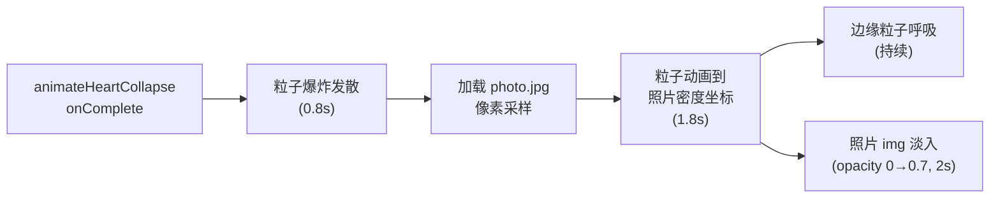

# 爱心识别与第三阶段第二幕实现

## 涉及文件

只需修改 [`src/components/PhaseThree.vue`](src/components/PhaseThree.vue)。  
用户需要提前将合影放到 `public/photo.jpg`（组件顶部有常量可修改）。

---

## 一、爱心形状识别

Design.md 要求"只要大致封闭即视为完成，不强制标准爱心"，因此使用三个宽松条件，全部满足才触发：

**条件 1 — 路径覆盖面积**

使用 Shoelace 公式（多边形有向面积）对所有 `pathPoints` 计算近似围合面积。  
阈值设为世界坐标 4.0（约占屏幕的 1/5），保证有实质的形状，不因零散几笔触发。

```typescript
const calcPathArea = (pts: THREE.Vector2[]): number => {
  let area = 0
  const n = pts.length
  for (let i = 0; i < n; i++) {
    const j = (i + 1) % n
    area += pts[i].x * pts[j].y - pts[j].x * pts[i].y
  }
  return Math.abs(area) / 2
}
```

**条件 2 — 最小尺寸**

包围盒宽度 > 1.5，高度 > 1.2（世界坐标），防止一小团点触发。

**条件 3 — 闭合检测**

在每次 `pointerup` 结束后，检查当前笔画的最后一个点与「全局第一个点」的距离是否 ≤ 1.8（世界坐标）。这允许她分两笔画完左右两半，但每次抬手都会检测是否构成了"回到起点"的闭合。

**软拒绝提示**

未满足条件时不终止，而是显示 `showShapeHint = ref(true)`，渲染一行灰色小字：  
`"再多画几笔，让爱心更完整"` — 1.5 秒后自动消失，引导她继续。

---

## 二、第二幕：回忆显影

在 `act1Complete` 之后接入，组件内增加 `currentAct = ref<1 | 2>(1)`，整个第三阶段在同一组件内以状态驱动，不新建组件。

### 数据流



### 照片采样算法

以低分辨率（160×H）加载照片，对每个粒子做**加权拒绝采样**（越暗的像素被选中概率越高），生成 `PARTICLE_COUNT` 个目标坐标，映射到世界空间，居中显示。

```typescript
const PHOTO_URL = '/photo.jpg' // 用户替换此路径

const samplePhotoTargets = (): Promise<Float32Array> =>
  new Promise((resolve) => {
    const img = new Image()
    img.onload = () => {
      const W = 160
      const H = Math.round(W * img.height / img.width)
      const canvas = document.createElement('canvas')
      canvas.width = W; canvas.height = H
      const ctx = canvas.getContext('2d')!
      ctx.drawImage(img, 0, 0, W, H)
      const data = ctx.getImageData(0, 0, W, H).data
      const worldW = 7.5
      const worldH = worldW * H / W
      const targets = new Float32Array(PARTICLE_COUNT * 3)
      for (let i = 0; i < PARTICLE_COUNT; i++) {
        let px = 0, py = 0, tries = 0
        do {
          px = Math.floor(Math.random() * W)
          py = Math.floor(Math.random() * H)
          const base = (py * W + px) * 4
          const gray = (data[base] + data[base + 1] + data[base + 2]) / 3
          if (Math.random() < (255 - gray) / 255 + 0.12) break
        } while (++tries < 30)  // 超过30次直接取随机位置（防止死循环）
        targets[i * 3] = (px / W - 0.5) * worldW
        targets[i * 3 + 1] = -(py / H - 0.5) * worldH
        targets[i * 3 + 2] = (Math.random() - 0.5) * 0.1
      }
      resolve(targets)
    }
    img.src = PHOTO_URL
  })
```

### 动画序列 `startAct2()`

1. **爆炸**（0-0.8s）：所有粒子从中心向外随机散射（scale × 5-10），GSAP `power2.out`
2. **等待照片加载**：调 `samplePhotoTargets()`（通常 < 0.5s）
3. **粒子向照片坐标汇聚**（1.8s）：`progressObj` + 线性插值，`ease: 'power2.inOut'`，粒子颜色也渐变为暖白色（从蓝白色过渡）
4. **呼吸**：在 `animate()` 帧循环中，对随机抽取的 5% 粒子做 `±0.03 * sin(time + i)` 扰动（仅 Y 轴）
5. **照片淡入**（2-4s）：模板中一个绝对定位的 `` 元素，用 `gsap.to(photoRef, { opacity: 0.7, duration: 2 })` 驱动

### 模板新增

```html

```

CSS：`object-fit: cover`，覆盖屏幕，`pointer-events: none`。

---

## 需改动的具体位置（均在 PhaseThree.vue）

- 顶部新增常量 `PHOTO_URL = '/photo.jpg'`
- 新增 refs：`currentAct`、`showShapeHint`、`photoRef`
- 新增变量：`firstPathPoint`（记录第一笔的第一个点）、`act2BreathingTime`
- 新增函数：`calcPathArea()`、`isHeartRecognized()`、`samplePhotoTargets()`、`startAct2()`
- 修改 `handlePointerDown`：记录 `firstPathPoint`
- 修改 `handlePointerUp`：用 `isHeartRecognized()` 替换点数判断，未通过时显示 `showShapeHint`
- 修改 `animateHeartCollapse` 的 `onComplete`：调 `startAct2()` 而非 `emit('act1Complete')`（act1Complete 改为在 act2 结束或永续后 emit，或直接不 emit 留在此幕）
- 修改 `animate()`：在 `currentAct === 2` 时加入呼吸扰动逻辑
- 修改 `resetDrawing`：重置 `firstPathPoint`、`showShapeHint`、`currentAct`
- 模板新增 `` 和 `showShapeHint` 提示文本
