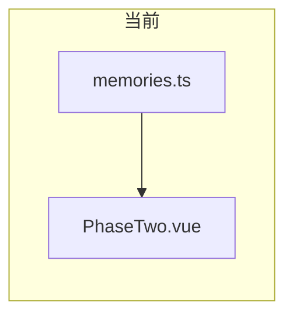
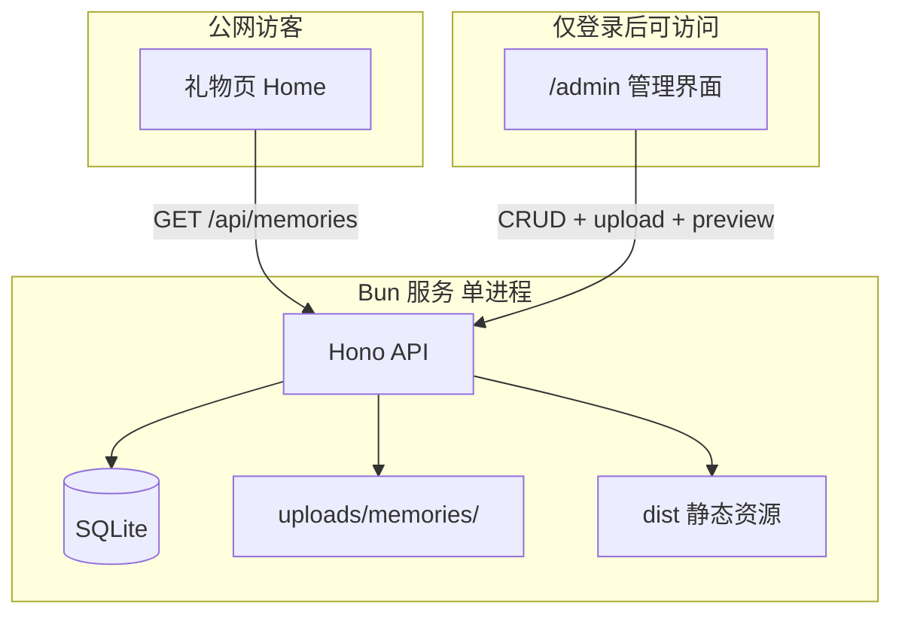

# 记忆点管理后台 — 需求与实施方案

## 你已确认的需求

| 维度 | 你的选择 |
|------|----------|
| 使用场景 | 部署到 VPS，仅自己可访问（需登录） |
| 数据流 | 运行时 API，改完即生效，无需重新 build |
| 功能范围 | 完整 CRUD + 后台内预览（详情页 + 星球节点） |
| 球面位置 | 新增时自动均匀分布；列表里可微调 theta/phi/orbitRadius |
| 媒体 | 后台内上传图片/音频，存服务器磁盘 |
| 部署 | VPS / Docker，持久化磁盘 |

## 现状（实现起点）

- 记忆点类型定义：[`src/types/memory.ts`](src/types/memory.ts)
- 当前 7 条硬编码数据：[`src/data/memories.ts`](src/data/memories.ts)
- 礼物页阶段二直接 import 静态数组：[`src/components/PhaseTwo.vue`](src/components/PhaseTwo.vue) 第 4、108 行
- 媒体在 [`public/memories/`](public/memories/)
- 项目为纯前端 Vite + Vue，**无现有后端**



## 目标架构



**设计原则（对齐 Karpathy 准则）：**
- 礼物页读接口 **无需登录**（否则女友打开页面要输密码）
- 写接口、上传、管理页 **必须登录**
- 单管理员密码（环境变量），不做多用户系统
- VPS 场景用 **SQLite + 本地文件**，不引入对象存储

---

## 一、后端（Bun + Hono）

**新建目录建议：** `server/`（与 `src/` 并列）

### 1.1 依赖与脚本

- 使用 **bun** 安装：`hono`、`@hono/node-server`（或 Bun 原生 serve）、`zod`（请求校验）
- SQLite：优先 **`bun:sqlite`**（零额外原生依赖）
- `package.json` 增加：`dev:server`、`dev:all`（并行 Vite + API）、`start`（生产单进程）

### 1.2 数据模型（SQLite）

表 `memories`，字段与现有 `Memory` 对齐，JSON 列存 `content`：

- `id` TEXT PRIMARY KEY
- `type`, `title`, `date`, `color`
- `theta`, `phi`, `orbit_radius`
- `content` JSON（text / imageUrl / audioUrl / location / theme）
- `sort_order` INTEGER（列表排序，可选）
- `created_at`, `updated_at`

表 `sessions` 或仅用 **签名 Cookie**（Hono 内置 cookie + `ADMIN_PASSWORD` 哈希比对即可，会话 7 天）

### 1.3 API 设计

| 方法 | 路径 | 鉴权 | 说明 |
|------|------|------|------|
| POST | `/api/auth/login` | 无 | body: `{ password }`，成功 Set-Cookie |
| POST | `/api/auth/logout` | 无 | 清 Cookie |
| GET | `/api/auth/me` | Cookie | 管理页校验登录态 |
| GET | `/api/memories` | **无** | 礼物页拉全量列表 |
| GET | `/api/admin/memories` | 需登录 | 管理列表（可含草稿标记，若后续需要） |
| POST | `/api/admin/memories` | 需登录 | 新增（含自动分布位置） |
| PUT | `/api/admin/memories/:id` | 需登录 | 编辑 |
| DELETE | `/api/admin/memories/:id` | 需登录 | 删除 |
| POST | `/api/admin/upload` | 需登录 | multipart，返回 `/uploads/memories/{filename}` |
| GET | `/uploads/*` | 无 | 静态文件服务 |

**自动分布算法（新增时）：**

- 已有 N 个点时，第 N+1 个点用 **Fibonacci 球面采样**（黄金角螺旋）生成 `(theta, phi)`，与现有点做最小距离校验，过近则微调
- `orbitRadius` 默认 `1.05 ~ 1.15` 交替，避免全部贴球面
- `color` 可从预设调色板按序号轮换，表单可覆盖

### 1.4 认证实现（简单够用）

- 环境变量：`ADMIN_PASSWORD`（生产必设）、`SESSION_SECRET`
- 登录成功：`HttpOnly` + `Secure`（HTTPS）+ `SameSite=Lax` Cookie
- 管理路由中间件：无有效 Cookie → `401`
- **不**把管理页藏在「秘密 URL」 alone — URL 可猜，必须靠 Cookie

### 1.5 数据迁移

- 一次性脚本 `server/seed.ts`：把 [`src/data/memories.ts`](src/data/memories.ts) 中 7 条写入 SQLite
- 现有 `public/memories/*` 复制或继续引用；新上传走 `uploads/memories/`
- 礼物页 `imageUrl` / `audioUrl` 统一为绝对路径前缀（`/uploads/...` 或 `/memories/...`），由 API 返回完整路径

### 1.6 生产部署（Docker）

- `Dockerfile`：多阶段 build 前端 `bun run build` → 拷贝 `dist` + `server` + `uploads` 卷挂载点
- `docker-compose.yml`：映射端口、挂载 `./data`（sqlite + uploads）、注入 env
- 进程：**同一 Bun 服务** 提供 API + `dist` 静态 + uploads（避免 CORS 与双域名）

开发时 Vite 代理：

```ts
// vite.config.ts 增加
server: {
  proxy: {
    '/api': 'http://localhost:3000',
    '/uploads': 'http://localhost:3000'
  }
}
```

---

## 二、管理前台（Vue `/admin`）

**新建：** `src/views/admin/`、`src/router` 增加 `/admin` 路由树

### 2.1 页面结构

1. **`/admin/login`** — 密码表单
2. **`/admin/memories`** — 表格列表：标题、日期、类型、颜色点、操作（编辑/删除/预览）
3. **`/admin/memories/new`**、`/admin/memories/:id/edit`** — 表单

### 2.2 表单字段（与类型一致）

- 基础：`id`（新建可自动生成 `memory-{slug}`）、`type`、`title`、`date`、`color`（色板 + 自定义）
- 内容：`content.text`（多行）、`theme`（下拉，选项来自 `ParticleTheme`）、`location`、`imageUrl`、`audioUrl`
- 高级（可折叠）：`theta`、`phi`、`orbitRadius` 数字输入 + 「重新自动分布」按钮
- 媒体：上传组件 → 调 `/api/admin/upload` → 回填 URL

### 2.3 预览（你的核心诉求）

**详情预览：** 复用现有 [`MemoryDetail.vue`](src/components/MemoryDetail.vue)，传入 `activeMemory` + 固定 `phase="viewing"` 的包装组件（侧栏或弹层全屏预览）

**星球预览：** 复用 [`MemoryPlanet.vue`](src/components/MemoryPlanet.vue) 的简化模式：
- `phase="exploring"`，`skipForming=true`
- `memories` = 当前草稿 + 库中已有节点（或仅高亮当前 id）
- 容器固定高度（如 400px），避免管理页加载过重

路由守卫：`/admin/*`（除 login）先 `GET /api/auth/me`，未登录跳转 login

### 2.4 API 客户端

- 轻量 `src/api/memories.ts`：`fetch` + 类型复用 `@/types/memory`
- Pinia 可选；列表页用 `ref` + 请求即可（避免过度抽象）

---

## 三、礼物页改造（最小侵入）

[`src/components/PhaseTwo.vue`](src/components/PhaseTwo.vue)：

- 移除 `import { memories } from '@/data/memories'`
- `onMounted` 时 `GET /api/memories`，`loading` / `error` 状态（失败时可显示简短提示或回退空数组）
- `MemoryPlanet`、visited 逻辑 **不变**

[`src/data/memories.ts`](src/data/memories.ts)：保留为 **seed 源 / 开发回退注释**，不再被运行时引用（或仅 `import.meta.env.DEV` 回退，二选一，建议 seed 后删除运行时依赖）

---

## 四、安全与运维清单

- 礼物 API 只读；所有写操作走 `/api/admin/*`
- 上传：限制 MIME（image/*, audio/mpeg,audio/mp3）、单文件大小（如 10MB）、文件名 sanitize
- 生产必须 HTTPS（Cookie Secure）
- 备份：`data/memories.db` + `uploads/` 目录定期拷贝
- CORS：同域部署可不开；若前后端分离再补

---

## 五、实施顺序与验证

1. **后端 + seed** → `curl GET /api/memories` 返回 7 条
2. **登录 + CRUD** → Postman/ curl 验证 401/200
3. **上传** → 返回可访问的 `/uploads/...` URL
4. **管理 UI 列表/表单** → 增删改后 DB 变化
5. **预览面板** → 与线上 MemoryDetail / MemoryPlanet 一致
6. **PhaseTwo 接 API** → 本地 dev 全流程；Docker 部署验证持久化

**成功标准：**
- 登录后可在浏览器完成：新增一条记忆（含上传图）→ 列表可见 → 预览详情与星球位置合理 → 未登录打开礼物页能看到新节点 → 重启容器数据仍在

---

## 六、刻意不做（避免过度设计）

- 多用户 / RBAC
- 草稿发布流（除非你后续提出要「先藏后放」）
- 可视化 3D 点选位置（你已选自动分布 + 数字微调）
- 对象存储 / Serverless 适配（VPS 不需要）
- 改写 [`memories.ts`](src/data/memories.ts) 的 Git 自动生成（API 即数据源）

---

## 主要改动文件（预估）

| 区域 | 文件 |
|------|------|
| 后端 | `server/index.ts`, `server/db.ts`, `server/routes/*.ts`, `server/seed.ts` |
| 部署 | `Dockerfile`, `docker-compose.yml`, `.env.example` |
| 前端 API | `src/api/*.ts`, `src/stores`（可选） |
| 管理 UI | `src/views/admin/*`, `src/router/index.ts` |
| 礼物页 | `src/components/PhaseTwo.vue`, `vite.config.ts` |
| 复用 | `MemoryDetail.vue`, `MemoryPlanet.vue`, `types/memory.ts` |
