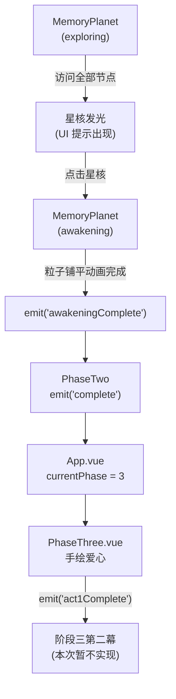

# 阶段二至阶段三过渡实现

## 整体数据流



## 需要改动的文件

### 1. [`src/types/memory.ts`](src/types/memory.ts)
- `PlanetPhase` 类型新增 `'awakening'`

```typescript
export type PlanetPhase = 'forming' | 'exploring' | 'zooming' | 'viewing' | 'returning' | 'awakening'
```

### 2. [`src/components/MemoryPlanet.vue`](src/components/MemoryPlanet.vue)

**新增星核 Sprite：**
- `createCoreSprite()`：在 `origin(0,0,0)` 创建一个 `THREE.Sprite`，初始 `opacity: 0`，使用暖色（粉金）glow 贴图，`scale(0.15)`

**节点访问追踪：**
- 模块变量 `visitedIds = new Set<string>()`
- 在 `handleClick` 命中节点时 `visitedIds.add(memory.id)`
- 若 `visitedIds.size >= props.memories.length`，调用 `activateCore()`

**`activateCore()`：**
- GSAP pulse 动画：核心 Sprite opacity 0→0.9，scale 反复呼吸
- 核心进入可点击状态，raycaster 检测命中后 `emit('nodeClick')` 改为判断：若命中的是 `coreSprite` 且 phase 为 `exploring`，触发 phase → `'awakening'`

**`animateAwakening()`：**
- 停止旋转（不再自增 `rotation.y`，通过 `phase` 守卫实现）
- 节点 Sprite 全部淡出
- 星核淡出
- GSAP `progressObj`：将所有粒子从球面位置动画到随机的**大范围平面**坐标（XY 扩散，Z 趋向 0），持续 2.0s，`ease: 'power2.inOut'`
- 动画结束时 `emit('awakeningComplete')`

**新增 emit：** `(e: 'awakeningComplete'): void`

**`watch` 新增 case：**
```typescript
case 'awakening':
  animateAwakening()
  break
```

### 3. [`src/components/PhaseTwo.vue`](src/components/PhaseTwo.vue)

- `PlanetPhase` 引入 `'awakening'`
- `visitedCount = ref(0)` 追踪已访问节点数
- `showCoreHint = computed(...)` 当 `visitedCount >= memories.length` 时为 `true`
- `handleNodeClick` 中 `visitedCount++`（用 Set 去重）
- 新增处理 `@awakening-complete="handleAwakeningComplete"`：
  - `handleAwakeningComplete()` → 内部设 transitioning 状态 → `emit('complete')`
- 模板新增：当 `showCoreHint` 时，在屏幕顶部淡入文字提示「你已点亮了所有回忆，触碰星球的心脏」

**新增 emit：** `(e: 'complete'): void`

### 4. [`src/App.vue`](src/App.vue)

- 导入 `PhaseThree`
- `handlePhaseTwoComplete()`：与 `handlePhaseOneComplete` 结构相同，设 `isTransitioning → currentPhase = 3`
- 模板 `<PhaseTwo>` 加上 `@complete="handlePhaseTwoComplete"`
- 新增阶段三渲染：
```html
<Transition name="phase-fade">
  <PhaseThree v-if="currentPhase === 3" @act1-complete="handleAct1Complete" />
</Transition>
```

### 5. [`src/components/PhaseThree.vue`](src/components/PhaseThree.vue)（新建）

使用 Three.js（与阶段一/二一致）实现第一幕。

**粒子场初始化：**
- 约 15,000 个银白色粒子，均匀分布在相机正对的 XY 平面（Z=0），相机在 `(0,0,4)` 正视
- 使用 `PointsMaterial + AdditiveBlending`，与已有风格一致

**手绘交互（2D canvas 叠加层）：**
- 在 Three.js canvas 之上叠加一个透明 `<canvas>` 接收触摸/鼠标事件
- `pointerdown` → 开始记录路径点数组 `pathPoints[]`
- `pointermove` → 追加路径点，同时找 Three.js 粒子中距当前点最近的若干个，用 GSAP 动画吸附到该点，材质 `opacity` 增强（视觉发光）
- `pointerup` → 路径记录结束，若路径点 >= 20 个（有效笔画），触发爱心塌缩动画

**塌缩动画（`animateHeartCollapse`）：**
- 2s GSAP：所有吸附到路径上的粒子向路径几何中心塌缩（产生「黑洞吸入」感）
- 塌缩完成后 `emit('act1Complete')`（为下一幕预留接口，当前 App.vue 暂不处理）

**「重新画」按钮：**
- 点击后 GSAP 将所有粒子归位到初始随机位置，清空 `pathPoints`，清空 2D canvas

**提示文案：** 屏幕中央（打字机动效）`"用你的指尖，画出心中的形状"`，首次交互后消失
